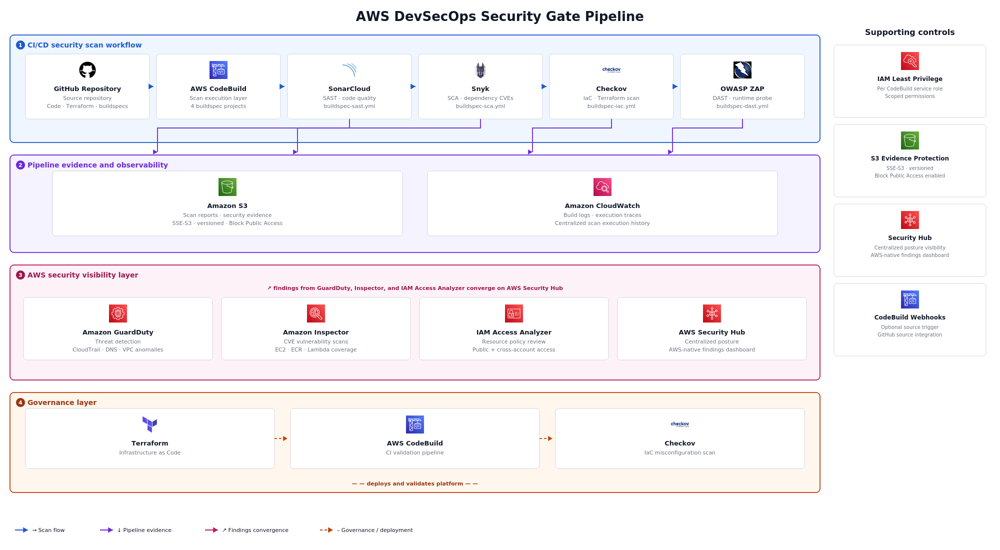

# AWS DevSecOps Security Gate Pipeline

[](https://github.com/iamwillsoto/aws-devsecops-security-gate-pipeline/actions/workflows/devsecops-release-gate.yml)

A GitHub-to-AWS DevSecOps release gate that validates application code, open-source dependencies, Terraform infrastructure, secrets exposure, and running web endpoints before release.

---

## Problem

Software delivery pipelines move faster than manual security review. Vulnerable application code, exposed dependencies, leaked secrets, misconfigured Terraform resources, and unscanned web endpoints can be promoted before any control catches them.

For cloud teams, this creates release risk, operational risk, and weak audit evidence. Security validation needs to run as part of the delivery workflow — not after deployment.

## Solution

AWS DevSecOps Security Gate Pipeline executes pre-release security validation as an automated control loop:

```text
source → scan → evaluate → store evidence → log execution → gate
```

GitHub Actions acts as the developer-facing release control plane. It validates pull requests and pushes, runs a GitLeaks secrets scan, authenticates to AWS using encrypted repository secrets with scoped IAM credentials, triggers AWS CodeBuild scan projects, waits for scan results, and fails the workflow if a required control fails.

AWS CodeBuild executes the heavier security scan stages, each driven by a dedicated buildspec:

- Secrets scanning with GitLeaks
- SAST with SonarQube Cloud
- SCA with Snyk
- IaC scanning with Checkov
- DAST with OWASP ZAP

Scan reports persist to Amazon S3 as security evidence. Execution logs centralize in CloudWatch. AWS Security Hub, GuardDuty, Inspector, and IAM Access Analyzer extend visibility into the runtime AWS environment alongside CI/CD security validation.

---

## Architecture



---

## Stack

| Layer | Service / Tool |
|---|---|
| Source Repository | GitHub |
| Release Control Plane | GitHub Actions |
| Secrets Scanning | GitLeaks |
| AWS Authentication | GitHub encrypted secrets + scoped IAM credentials |
| Scan Execution | AWS CodeBuild |
| Static Code Analysis | SonarQube Cloud |
| Dependency Scanning | Snyk |
| Infrastructure-as-Code Scanning | Checkov |
| Dynamic Web Scanning | OWASP ZAP |
| Evidence Storage | Amazon S3 (SSE-S3, versioned, Block Public Access) |
| Observability | Amazon CloudWatch Logs |
| Cloud Security Visibility | AWS Security Hub, GuardDuty, Inspector, IAM Access Analyzer |
| Infrastructure | Terraform |
| Access Control | AWS IAM, GitHub encrypted secrets |

---

## Security Gate Flow

```text
GitHub pull request or push
        ↓
GitHub Actions release gate starts
        ↓
GitLeaks scans for exposed secrets
        ↓
GitHub Actions authenticates to AWS with encrypted secrets
        ↓
GitHub Actions triggers AWS CodeBuild
        ↓
SAST scan runs with SonarQube Cloud
        ↓
SCA scan runs with Snyk
        ↓
IaC scan runs with Checkov
        ↓
DAST scan runs with OWASP ZAP
        ↓
Scan reports upload to Amazon S3
        ↓
Execution logs write to CloudWatch
        ↓
GitHub Actions returns pass/fail release status
```

---

## Scan Controls

Each security control is separated for easier validation, troubleshooting, and auditability.

| Control | Tool | Execution Layer |
|---|---|---|
| Secrets scanning | GitLeaks | GitHub Actions |
| Static application security testing | SonarQube Cloud | AWS CodeBuild |
| Software composition analysis | Snyk | AWS CodeBuild |
| Infrastructure-as-code scanning | Checkov | AWS CodeBuild |
| Dynamic application security testing | OWASP ZAP | AWS CodeBuild |

Each AWS-backed scan runs as its own CodeBuild project with a dedicated buildspec.

| CodeBuild Stage | Buildspec |
|---|---|
| SAST | `buildspec-sast.yml` |
| SCA | `buildspec-sca.yml` |
| IaC | `buildspec-iac.yml` |
| DAST | `buildspec-dast.yml` |

---

## AWS Security Visibility Layer

Alongside the CI/CD scan stages, four AWS-native security services run continuously:

- **AWS Security Hub** — centralized security posture visibility
- **Amazon GuardDuty** — threat detection across CloudTrail, DNS, and VPC activity
- **Amazon Inspector** — vulnerability scanning for EC2, ECR, and Lambda
- **IAM Access Analyzer** — external access review for resource policies

These services demonstrate how pipeline-level controls operate alongside AWS-native runtime visibility — the prevention side of cloud security paired with continuous detection.

---

## Evidence and Observability

Security reports are stored in an S3 bucket with server-side encryption (SSE-S3), versioning, and Block Public Access enabled. Each CodeBuild execution writes structured logs to CloudWatch under the project log group, preserving scan run history.

GitHub Actions surfaces release-gate status directly in the repository through workflow results, job summaries, and the README badge. CodeBuild build status communicates the security decision for each scan stage: a passing build means that control met its threshold; a failing build represents a blocking finding or execution issue that requires review.

---

## Validation

The system was validated through GitHub Actions and dedicated AWS CodeBuild scan jobs against the sample application and Terraform infrastructure.

| Stage | Result |
|---|---|
| GitHub Actions release gate | Workflow created and executed from the repository |
| GitLeaks secrets scan | Repository scanned for exposed secrets before AWS scan execution |
| SonarQube Cloud SAST | Source analysis completed; dashboard captured |
| Snyk SCA | Dependency scan executed against the sample app |
| Checkov IaC | Terraform scan executed through CodeBuild |
| OWASP ZAP DAST | Web endpoint scan completed; reports uploaded to S3 |
| S3 evidence storage | Scan reports persisted in the reports bucket |
| CloudWatch Logs | CodeBuild execution logs centralized under the project log group |
| Security Hub | Enabled for centralized posture visibility |
| GuardDuty | Enabled for AWS-native threat detection |
| Inspector | Enabled for vulnerability visibility |
| IAM Access Analyzer | External access analyzer created in `us-east-1` |

The initial DAST run failed because the OWASP ZAP container could not write reports to the mounted directory. The scan script was updated to recreate the reports directory with write permissions before launching the container. The corrected DAST scan completed successfully and uploaded artifacts to S3.

---

## Security Design Principles

- Pull request validation — GitHub Actions validates changes before merge
- Source-driven security validation — scans run from the repository, not post-deployment
- Secrets protection — GitLeaks scans for exposed credentials before AWS scan execution
- Encrypted secrets — AWS credentials and scanner tokens injected at runtime through GitHub encrypted secrets, never stored in code
- Separation of concerns — each security control runs through a dedicated workflow stage or CodeBuild project
- Least-privilege IAM — GitHub is scoped to start and read only the required CodeBuild projects
- Durable security evidence — versioned S3 reports with Block Public Access
- Centralized execution logs — CloudWatch log streams for CodeBuild scan executions
- Developer feedback — workflow status, job summaries, and README badge expose release-gate state
- IaC-only infrastructure — Terraform-managed CodeBuild projects, S3 buckets, and IAM roles
- AWS-native visibility — Security Hub, GuardDuty, Inspector, and IAM Access Analyzer enabled alongside pipeline scans
- Self-validating IaC — Checkov scans the system's own Terraform configuration

---

## Scope and Limitations

This implementation is scoped to a single AWS account and one repository. It demonstrates pre-release security validation using GitHub Actions as the release control plane and AWS CodeBuild as the security execution layer.

The DAST stage scans a configured target URL. In a production implementation, the target would be a staging endpoint deployed earlier in the pipeline.

Encryption uses S3 server-side encryption (SSE-S3) and AWS-managed CloudWatch Logs encryption. Customer-managed KMS keys are an enhancement path, not part of the current implementation.

GitHub Actions currently authenticates to AWS using encrypted repository secrets and scoped IAM credentials. A production implementation should replace long-lived access keys with GitHub OIDC and short-lived role assumption.

Production expansion paths include GitHub OIDC, branch protection with required status checks, CodePipeline orchestration, AWS Secrets Manager for scanner tokens, customer-managed KMS keys for scan evidence, automated ticket creation on findings, Security Hub finding ingestion, pull request comments with scan summaries, staging endpoint deployment for DAST, and multi-account rollout through AWS Organizations.

---

## Repository Structure

```text
aws-devsecops-security-gate-pipeline/
├── .github/
│   └── workflows/
│       └── devsecops-release-gate.yml
├── app/
│   ├── package.json
│   ├── package-lock.json
│   └── server.js
├── architecture/
│   └── aws-devsecops-security-gate-pipeline.png
├── buildspecs/
│   ├── buildspec-dast.yml
│   ├── buildspec-iac.yml
│   ├── buildspec-sast.yml
│   └── buildspec-sca.yml
├── infra/
│   ├── codebuild.tf
│   ├── iam.tf
│   ├── main.tf
│   ├── outputs.tf
│   ├── provider.tf
│   ├── s3.tf
│   ├── terraform.tfvars.example
│   └── variables.tf
├── scripts/
│   ├── run-dast.sh
│   ├── run-iac-scan.sh
│   ├── run-sast.sh
│   └── run-sca.sh
├── validation-screenshots/
├── .gitignore
└── README.md
```

---

## Project Outcome

AWS DevSecOps Security Gate Pipeline embeds security validation directly into the delivery workflow rather than relying on post-deployment review.

The system validates practical experience with GitHub Actions release enforcement, GitLeaks secrets scanning, GitHub encrypted secrets, scoped IAM permissions, AWS CodeBuild scan execution, SAST, SCA, IaC, and DAST security testing, SonarQube Cloud, Snyk, Checkov, and OWASP ZAP integration, S3-backed evidence storage, CloudWatch-based observability, AWS-native security visibility, and Terraform-managed AWS infrastructure.

It demonstrates pre-release security control across code, dependencies, infrastructure, secrets, and endpoints — identifying insecure patterns before they move forward rather than detecting them afterward.
